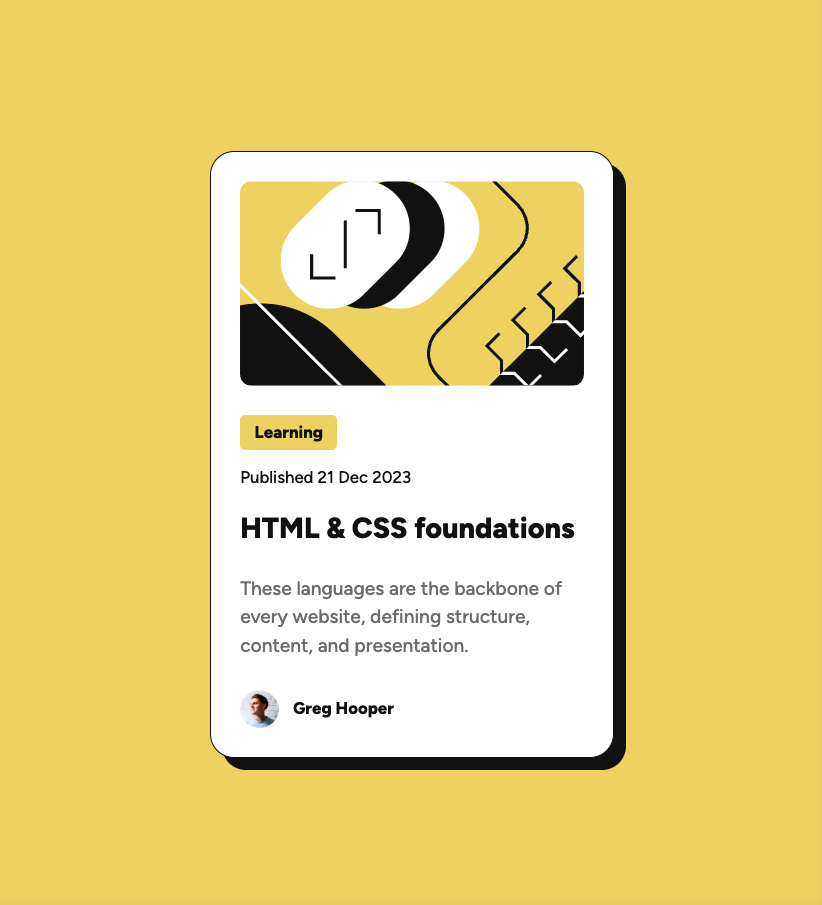

# Frontend Mentor - Blog preview card solution

This is a solution to the [Blog preview card challenge on Frontend Mentor](https://www.frontendmentor.io/challenges/blog-preview-card-ckPaj01IcS). Frontend Mentor challenges help you improve your coding skills by building realistic projects. 

## Table of contents

- [Overview](#overview)
  - [The challenge](#the-challenge)
  - [Screenshot](#screenshot)
  - [Links](#links)
- [My process](#my-process)
  - [Built with](#built-with)
  - [What I learned](#what-i-learned)
  - [Continued development](#continued-development)
  - [AI Collaboration](#ai-collaboration)
- [Author](#author)

## Overview

### The challenge

Users should be able to:

- See hover and focus states for all interactive elements on the page

### Screenshot

### Links

- [Solution URL](https://github.com/vikiluk/blog-preview-card)
- [Live Site URL](https://vikiluk.github.io/blog-preview-card)

## My process

### Built with

- HTML
- CSS
- Flexbox
- Local font files

### What I learned

- I learned how to structure a webpage using HTML tags like `
` or ``
- I learned how to use @font-face to load local font files
- I learned how to use box-shadow to create a solid shadow effect
- I learned about hover states using CSS pseudo-classes like :hover
- I learned the difference between ``(inline) and `
` (block) elements

### Continued development

I want to continue practicing HTML and CSS by working through more Frontend Mentor challenges. I'd like to get more comfortable with Flexbox and eventually learn new concepts like CSS Grid, responsive design, and maybe JavaScript in the future.

### AI Collaboration

I used Claude (Claude Code) as a guided mentor throughout this project. Claude walked me through each step — from structuring the HTML, writing CSS properties, using Flexbox for centering, to reading values from Figma. Rather than giving me the answers directly, Claude asked questions and gave hints to help me figure things out myself.

## Author

- GitHub - [vikiluk](https://github.com/vikiluk)
- Frontend Mentor - [@vikiluk](https://www.frontendmentor.io/profile/vikiluk)
- [LinkedIn](https://www.linkedin.com/in/viktória-lukáčová-960a51253/)